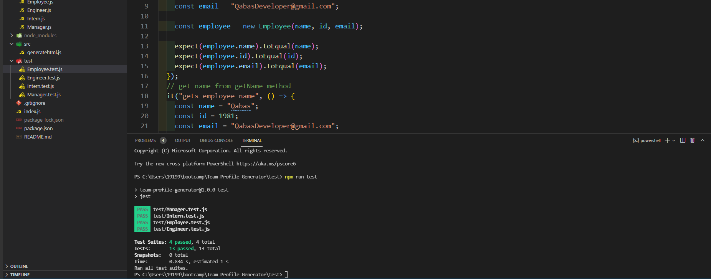
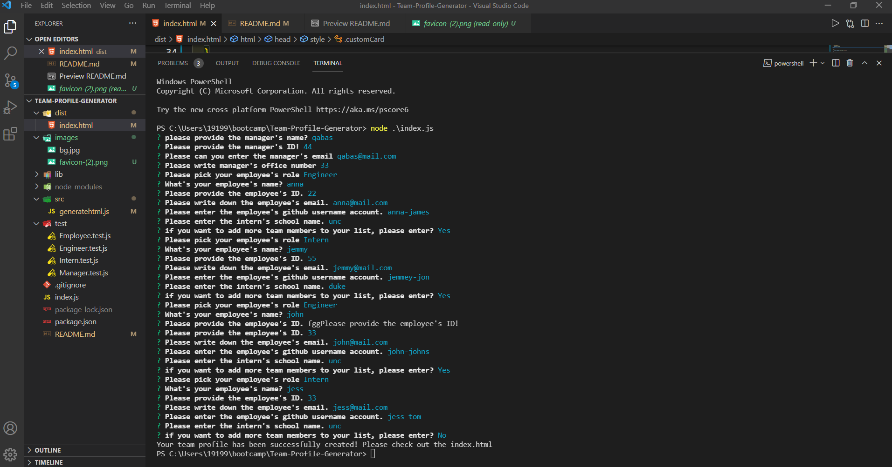

# Team Profile Generator
  ----
  
## Table of Contents
- [Description](#description)
- [Installation](#installation)
- [Technologies](#Technologies)
- [Usage](#usage)
- [Contribution](#contribution)
- [Test Instructions](#test-instructions)
- [Questions](#questions)

## Description:
It's back end project that's help users to create a web page for a team that are working together its stats by asking the leader or the manager the insert information about his employee and for each worker there are specific form of questions that have to be field to get full information about each person with each info.


## Technologies
```
- HTML.
- CSS.
- Bootstrap.
- JavaScript.
- Node.js.
- OOP.
- inquirer.
- fs.
- TDD.

```


## Features
 this project creates pages coming from the back end wit node.js and they will be generated in the html web page over and over and the  project demonstrates the use of OOP and TDD using Jest 


### Installation
```
npm install

```


### Usage
helps the user to create his own team with provided info to use them for later.


### Contribution
they  should read the installation section.


### Test-Instructions
Run   npm run test to run jest test for constructors


### A Screenshot of my deployed Team Profile Generator

 

 

[full demo video](https://drive.google.com/file/d/19JsnLfm42VMdz2rwTJ8NzsNYEQ27HjKN/view?usp=sharing)

[full demo test](https://drive.google.com/file/d/1cBjME56sAKVc2IYaWfi61q3i6wL30Vl8/view?usp=sharing)

### Questions? 
For any questions, please contact me with the information below:

doctorqa@yahoo.com

[LinkedIn Profile](https://www.linkedin.com/in/qabas-al-ani-7b858863/)

[Github Profile](https://github.com/Qabas-al-ani)
